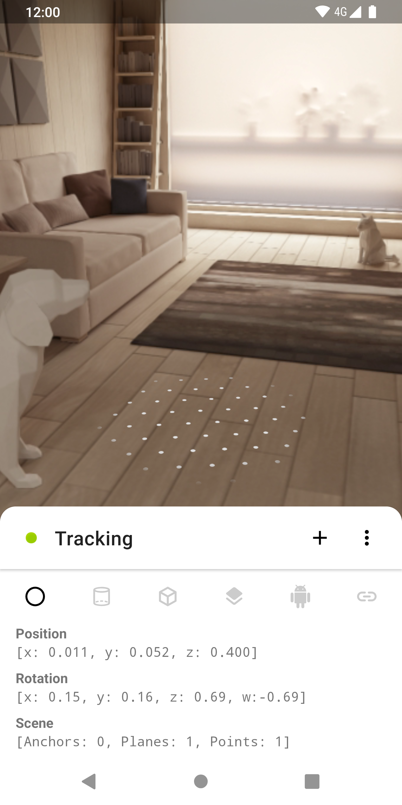
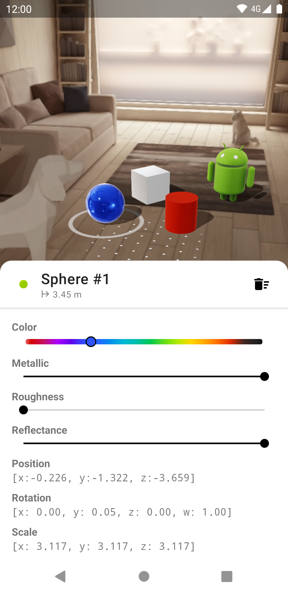
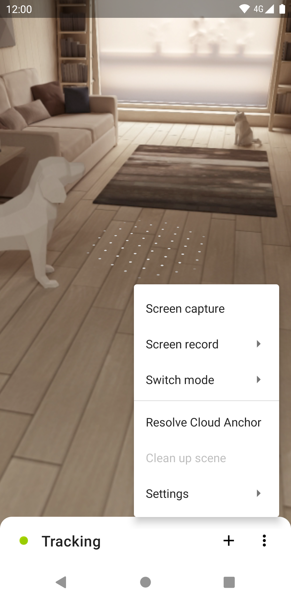
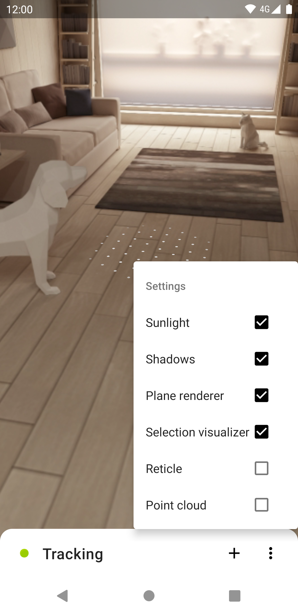
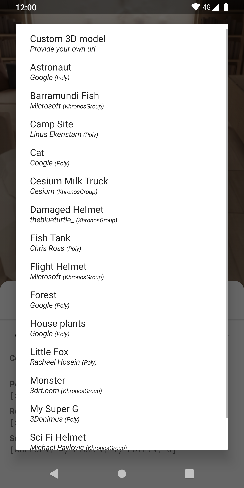
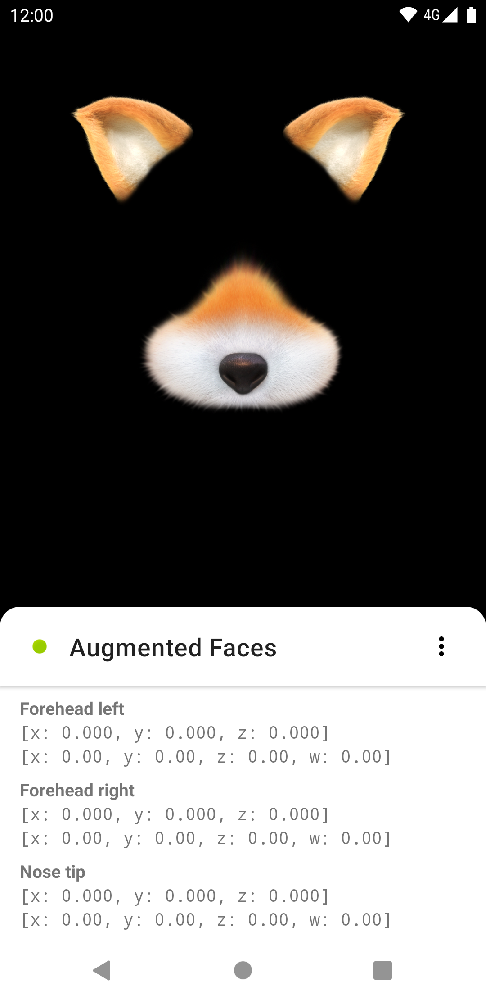
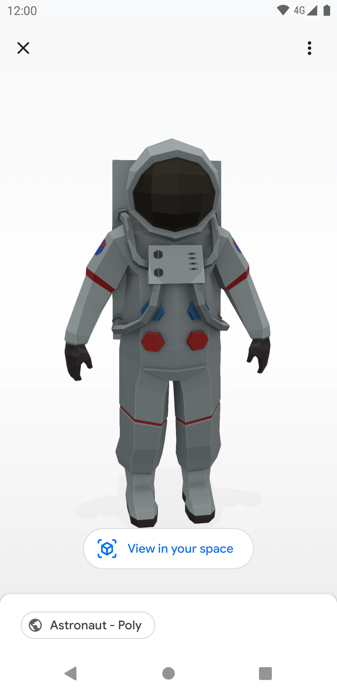

<div align="center">
  
</div>
<p align="center"></p>
<h3 align="center">AR Toolbox</h3>
<p align="center">
  ARCore & Sceneform Playground<br>
  <a href='https://play.google.com/store/apps/details?id=fr.smarquis.ar_toolbox'></a>
</p>

<br>

| Scene | Models | Options | Settings |
|---|---|---|---|
|  |  |  |  |

| Model chooser | Augmented Face | Native Viewer | Web Viewer |
|---|---|---|---|
|  |  |  |  |

### Features

- **Scene debug**: Camera position, Camera rotation, Anchors, Planes, Points
- **[Scene configuration](https://developers.google.com/ar/develop/java/sceneform/build-scene)**: Sunlight, Shadows, Plane renderer, Selection visualizer
- **[3D models](https://developers.google.com/ar/develop/java/sceneform/create-renderables)**: Sphere, Cylinder, Cube, Layout, sfa, Freehand drawing, glTF, Video
- **[Material properties](https://developers.google.com/ar/develop/java/sceneform/standard_properties.pdf)**: Color, Metallic, Roughness, Reflectance
- **[Gestures](https://developers.google.com/ar/develop/java/sceneform/build-scene)**: Drag, Rotate, Scale
- **[Augmented images](https://developers.google.com/ar/develop/java/augmented-images/)**: Tracks the application logo
- **[Augmented faces](https://developers.google.com/ar/develop/java/augmented-faces/)**: Identify regions of a detected face
- **[Native & web scene viewers](https://developers.google.com/ar/develop/java/scene-viewer)**: Interactive models in native or on the web
- **[Cloud anchors](https://developers.google.com/ar/develop/java/cloud-anchors/overview-android)**: Host, share and resolve anchors
- **[PointCloud](https://developers.google.com/ar/reference/java/arcore/reference/com/google/ar/core/PointCloud)**: Feature points
- **[Screen capture & recording](https://developers.google.com/ar/develop/java/sceneform/video-recording)**: 480p, 720p, 1080p, 2160p

## Credits

- [ARCore](https://github.com/google-ar/arcore-android-sdk)
- [Sceneform](https://github.com/google-ar/sceneform-android-sdk)
- [ColorSeekBar](https://github.com/divyanshub024/ColorSeekBar)
- [sceneform-samples](https://github.com/googlesamples/sceneform-samples)
- [glTF-Sample-Models](https://github.com/KhronosGroup/glTF-Sample-Models)
- [Poly](https://poly.google.com/)
- [\<model-viewer\>](https://github.com/GoogleWebComponents/model-viewer)

## License

```
Copyright 2019 Simon Marquis

Licensed under the Apache License, Version 2.0 (the "License");
you may not use this file except in compliance with the License.
You may obtain a copy of the License at

    http://www.apache.org/licenses/LICENSE-2.0

Unless required by applicable law or agreed to in writing, software
distributed under the License is distributed on an "AS IS" BASIS,
WITHOUT WARRANTIES OR CONDITIONS OF ANY KIND, either express or implied.
See the License for the specific language governing permissions and
limitations under the License.
```
